---
title: BRC Core
description: BRC Core
categories: [BrightCom, Product]
tags: [product]
weight: 3
----

# Vad är BRC Core

**BRC Core är en Microsoft Dynamics 365 Business Central-app som förbättrar bakgrundshanteringen av ditt ERP**

Appen tillhandahåller en samling lösningar som lägger till fördelaktiga funktioner till befintliga funktioner och processer för att förbättra system- och användarupplevelser.

**Nyckelfunktioner i BRC Core**

*   Jobbköövervakning
*   Moduladministration

**Fördelar med BRC Core**

*   Förbättra befintliga systemfunktioner och processer med väsentliga tekniska lösningar

**Tillgänglighet**

Appen stöder Essentials och Premium Editions av Microsoft Dynamics 365 Business Central

Länder som stöds: Sverige, Norge och Danmark

Språk som stöds: Denna app är tillgänglig på svenska

# Beskrivning funktioner

Funktioner som önskas användas behöver aktiveras av BrightCom.

## Background Monitor
Background Monitor bevakar jobbköer och vid behov startar om jobbköer samt mejlar statusrapport.

> Rekommenderar att jobbköer startar om efter 30 min, vilket ska bli standard och för stora kunder kan det behöva sättas 60 min för att tabellåsningar ska hinna släppa.

### BCS Jobbköövervakning Inställningar

Aktivera **BRCBackgroundMonitor**. I **BRC Jobbköövervakning Inställningar** sätts generella inställningar men går att ändra per jobbkö. Välj **Aktiverat**. **Jobbkö max försök** rekommenderas till 0. **Jobb max körtd (min)** rekommenderar 0 minuter men önskas inställning måste det tas hänsyn till längsta körning per dag genom att sätta lite längre tid så det hinner gå klart. **Standard tid mellan övervakning (min)** rekommenderas att sättas till 30 min. I **E-post error** ange mejladress till person som ska få lägesrapport. Aktivera **Disable mail in Monitor** om det inte ska skickas mejl när jobbkö återställts. Snabbflik JobQueTest är till för utvecklare. Välj **Setup Scheduler** för att skapa jobbköer.

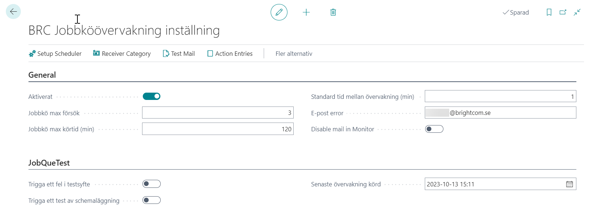

 Gå in under **Receiver Category** om önskar tilldela Kategori till jobbkö där kategorin styr vem som mejlas.

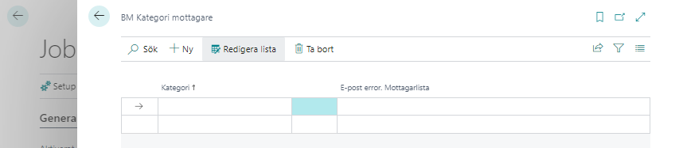

 Välj **Test Mail** för att skicka testmejl och verifiera att det fungerar för annars kommer det felposter i jobbkötransaktioner. Under **Action Entries** kan du se transaktioner om felsökning behöver göras på övervakningen. 

### Inställning per jobbkö

Sök **Jobbkötransaktioner**. **Codeunit 12078479 BRC Core BM Job Queue Monitor** är första bevakning. Rekommenderar att sätta **Antal minuter mellan körningar** till 30 minuter. **Codeunit 12078480 BRC Core BM Perform Action** bevakar att första bevakning är igång. Sätt att den körs dygnet runt med 60 min intervall. I kolumn **Övervakning på** ska de jobbköer som ska övervakas markeras. Ingen bock i codeunit **12078480** då den inte ska bevaka sig själv. I kolumn **Kategorikod för jobbkö** anges om önskar skicka fellogg enligt inställning i Receiver Category. Per jobbkö kan inställning ändras hur lång maxtid jobbkön får gå innan omstart och behövs bara ändras om annat än generellt värde. Görs i fält **Monitor Max Runtime** (min).

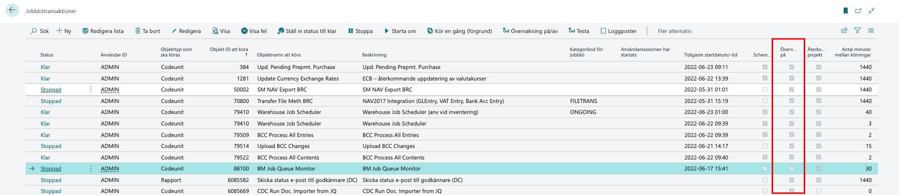

På övriga jobbköer som ska bevakas finns också inställningar som tillkommer med Background Monitor. Välj **Övervakning på** om jobbkön ska övervakas.  I **Kategorimottagare** anges Kategori mottagare om annan mottagare ska mejlas. I **Övervakning max körtid (min)** ange max antal minuter som jobbkön får köras.  Välj **BM Starta jobb** om övervakningen ska starta om jobbkön. Ange i **Job Queue Max Tries** maxantal försök som övervakningen ska försöka starta om jobbkön innan den får Status: Stoppad. Aktivera **Send Mail on Status OnHold** för att mejl omgående ska skickas när jobbkön får Status: Stoppad.

> _Övervakning måste vara aktiverad annars händer inget._

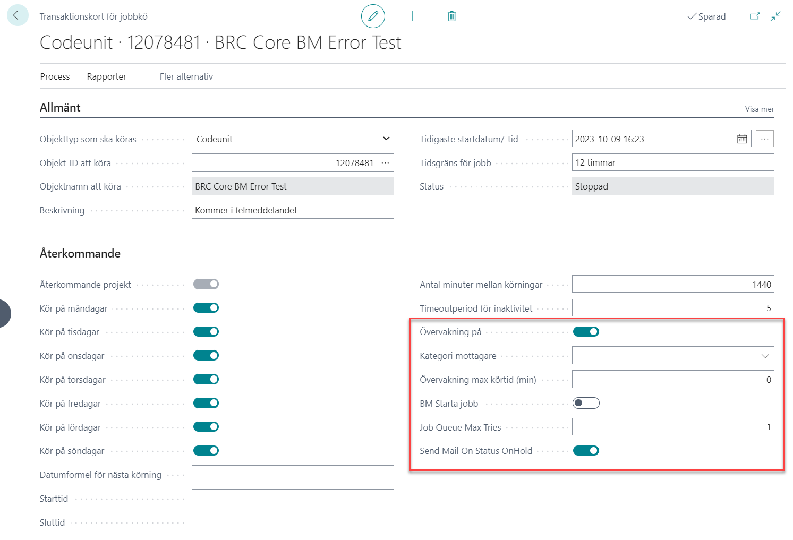

## Dimensioner - Artiklar

Aktivera **BRCItemDimensions**. I **Lagerinställningar** välj Item Dimensions. Valda dimensioner blir synliga i **Artiklar**. Under snabbflik Item Dimension kan dimensionsvärden väljas.

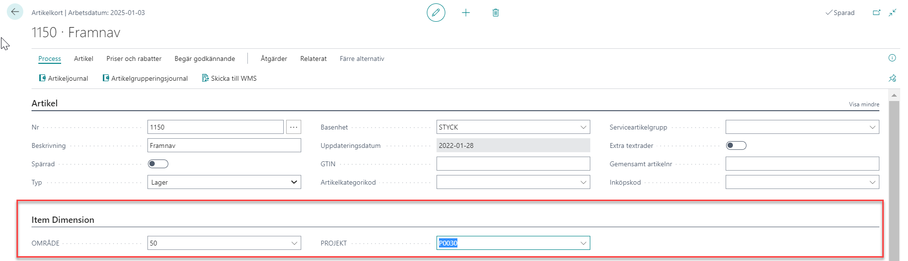

I listan för  **Artiklar** kan filter sättas på valda artikeldimensioner.

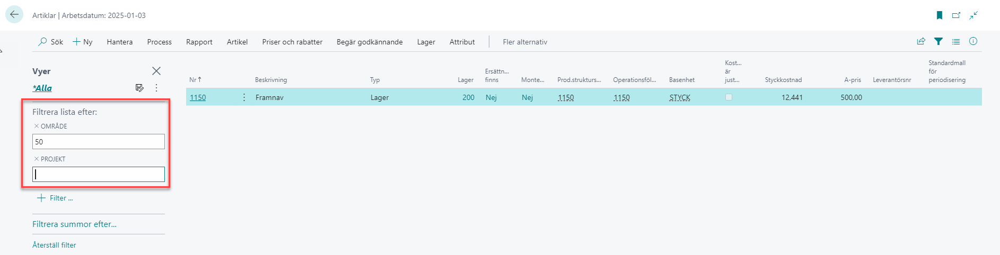

## Dimensioner - Lagerställen

I BC standard saknas funktion att ange dimensioner på  Lagerställen men är planerat till senare version.

I **Lagerställen** tillkommit inställningar för dimensioner. När ett lagerställe används i försäljnings- eller inköpsdokument i både huvud och rader så kommer dimensioner med från Lagerstället.

## Inköpsorder - Totalt antal och Återstående antal

Efter aktiverat funktion **BRCTotalQuantityOnPurchOrder** tillkommer två fält i huvudet på **Inköpsorder** som summerar Totalt antal och Återstående antal från inköpsorderrader i basenheten enligt artikelkortet.

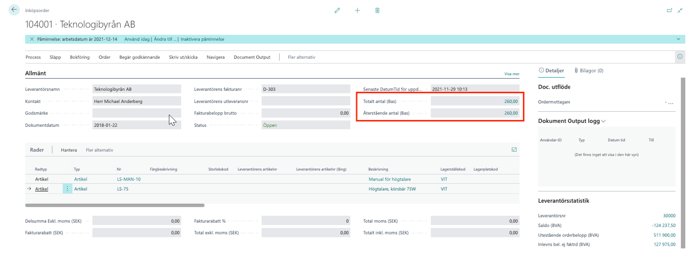

## Intrastat – Avrundning totalvikt 

Aktivera **BRCIntrastaTotalWeightRounding**. Om vikten på transaktionen är mindre än 1 kg tilldelas den 1 kg vilket krävs vid rapportering.

## Jobbkö – Användar id

Aktivera **BRCJobQueueUserId**. I Vid start av Jobbkö plockas användare-ID enligt inställt i fält BCS Användar-ID istället för användare-ID för den som startar jobbkön.

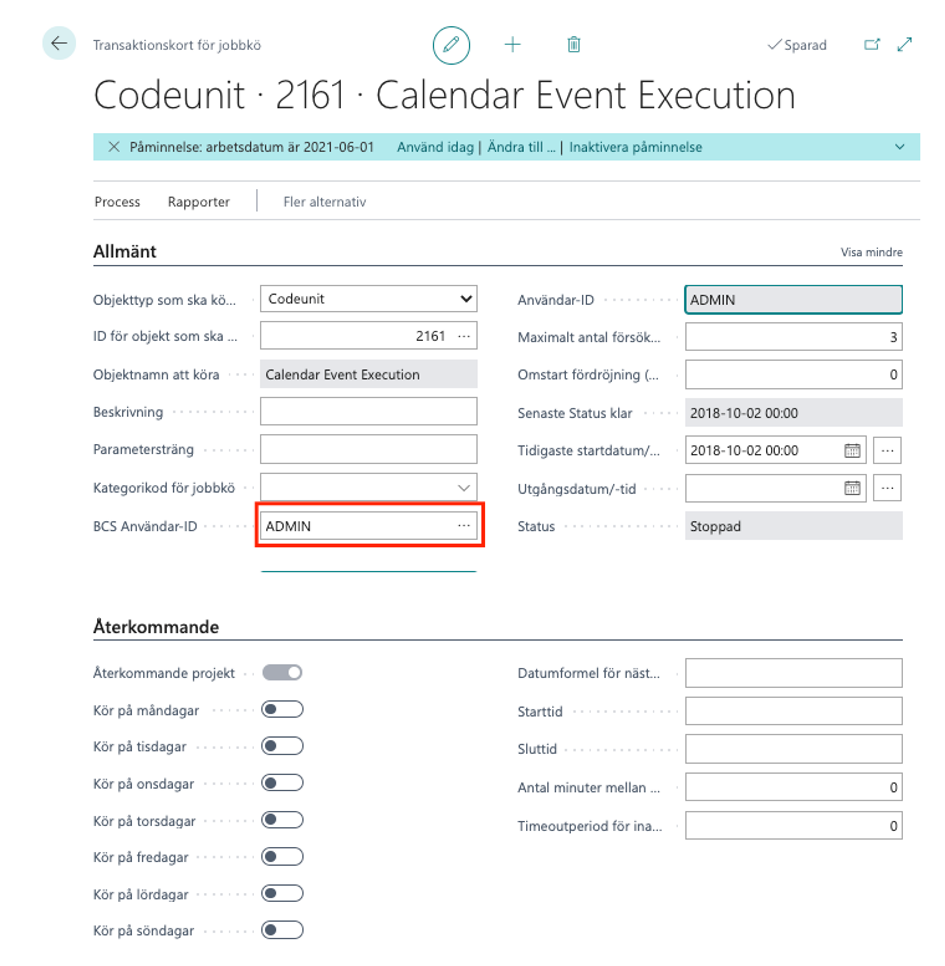

## Kopiera dokument - Ersätt bokförings- och momsdatum

I BC som standard kopieras Bokförings- och momsdatum med när funktion **Kopiera dokument** (i försäljning/inköp) används när bockat för **Ta med huvud**. Efter aktiverat funktion hämtas bokförings- och momsdatum in enligt inställning i **Försäljnings-/Inköpsinställningar** i fält **Standardbokföringsdatum: Inget datum/Arbetsdatum**.

## Momstransaktioner - rättar Momsdatum till Bokföringsdatum

I BC kan **Momstransaktioner** få olika datum i fält Bokföringsdatum och Momsdatum om detta sker kan detta behöva rättas. Rapporten rättar för alla transaktioner för valt datumintervall.

Aktivera **BRCVATReportingDate**. Sök **BRC VAT Reporting Date Adjust Reporting Date** och välj datumintervall i **Bokföringsdatum** för vilka momstransaktioner som ska ändras till att få samma Momsdatum som Bokföringsdatum.

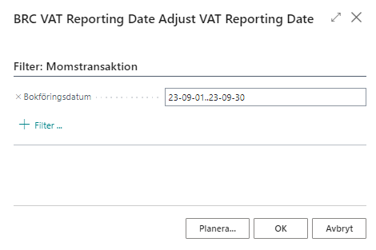

## Prislista inkl. moms – samma slutpris
I BC som standard är en prislista med inställning inkl. moms baserad på en Moms rörelsebokförings-mall som räknar bort momsen baklänges och sedan lägger på momsen enligt dokumentet vilket gör att om samma prislista används till dokument med olika Moms rörelsebokföringsmallar som har olika momssatser blir slutpriset olika vid inkl. moms.

Efter aktiverat funktion så blir Moms rörelsebokföringsmall enligt valt på dokumentet order/returorder/ faktura/kredit och pris inkl. moms blir som prislistan. Det är momssatsen och pris exkl. moms som blir olika beroende på Moms rörelsebokföringsmall på dokumentet.

Aktivera **BRCPriceListVATFromDocument**. Funktionen ställs in i **Kundprisgrupper** där det krävs att fält **Pris inkl. moms** är valt och att det är tomt i **Moms rörelsebokf.mall prisgr**.

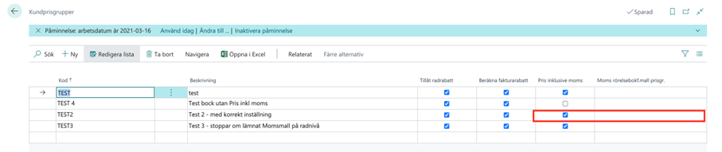

Dessutom sker kontroll vid nya rader i prislistan att de har samma värde som Kundprisgruppen i fälten Moms rörelsebokföringsmall prisgrupp och Pris inkl. moms samt att det inte går ändra motsvarande fält i Kundprisgruppen om det finns kopplade rader i prislistan.

## Prislista (NYA) inkl. moms – samma slutpris

I BC från version 21 finns ny funktion för prishantering som kan aktiveras och som annars kommer att aktiveras med automatik i version 24. En prislista med inställning _**inkl. moms**_ är baserad på en Moms rörelsebokförings-mall som räknar bort momsen baklänges. Vid orderläggning som standard så kommer felmeddelande om prislistan saknar Moms rörelsebokföringsmall. Efter aktiverat funktion så blir Moms rörelsebokföringsmall enligt valt på dokumentet order/returorder/ faktura/kredit och pris inkl. moms blir som prislistan. Det är momssatsen och pris exkl. moms som blir olika beroende på Moms rörelsebokföringsmall på dokumentet. Aktivera **New Price List. Get VAT from Document header**. 

## Valutakursuppdatering

I **Valutor** kontrollera att valutorna har både ISO-kod och ISO-därefter ställ in **Valutakurstjänst - Kurstjänster**.

Aktivera **BRCCurrExchRate**. 

Välj **Ny** och döp t ex. Riksbanken. I fält **Servicesida** välj tre punkter och välj tjänst **https:/brightcom.online/SEK/riksbanken.azure.se/latest** för att hämta från Riksbanken. Vill du hellre gå mot ECB (Europeiska Centralbanken) välj  https://D365Connect.com/EUR/ecb.europa.eu/latest.

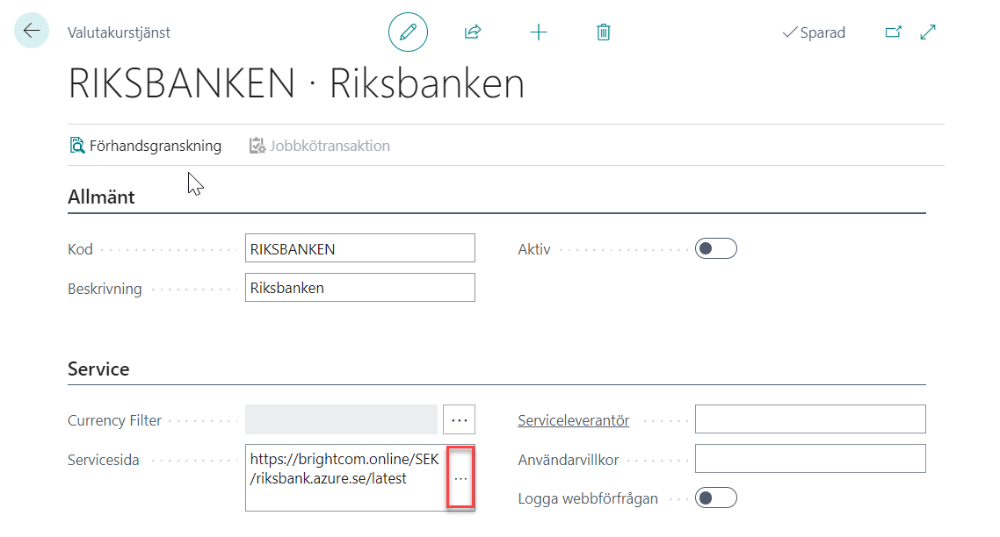

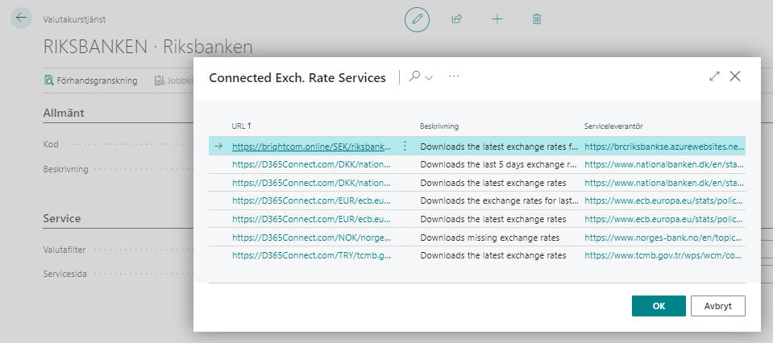

Aktivera valutakurstjänster genom välja **Process - Aktivera**. 

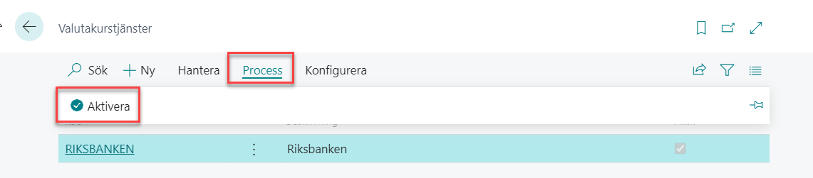

> _Från version 21 är det du som kund som har behörighet att Aktivera då det i samband med aktiveringen skapas en jobbkö. Från version 23 har du som kund möjlighet att ge BrightCom behörighet att skapa jobbköer._

Fönstret för jobbkö öppnas. Rekommenderar att justera tid i jobbkön till att uppdateras dagligen genom att välja **Datumformel för nästa körning** _**1D**_ samt **Starttid** _**23:45**_ för att kurs ska hunnit uppdateras hos Riksbanken samt att få samma kurs på alla transaktioner med samma datum.

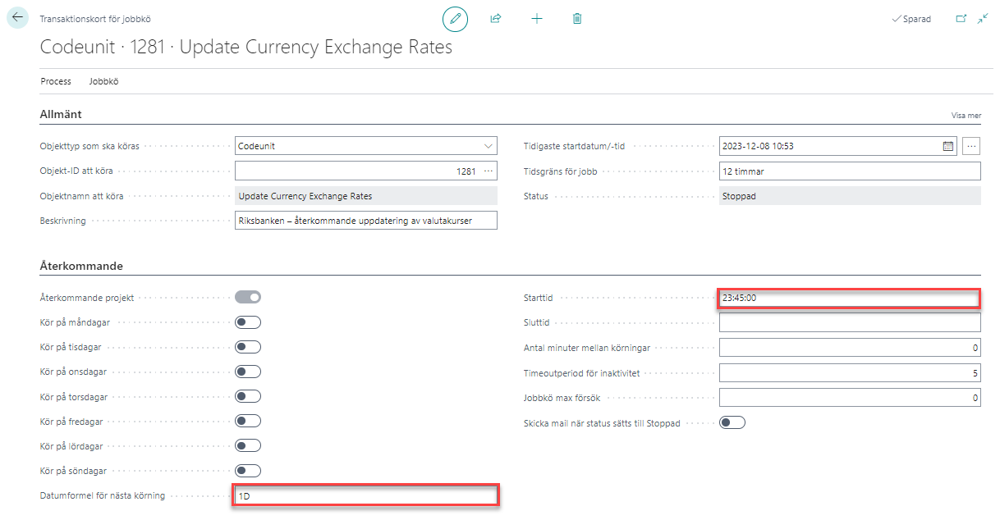

Gå tillbaka till fönster **Valutor** och välj **Valutakurstjänst – Uppdatera valutakurser**. 

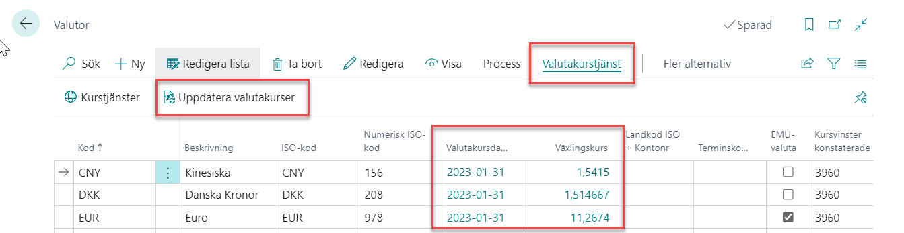

> Kontrollera att valutakurserna blir rätt första gången då konsekvenserna om de blir fel kan bli stora.